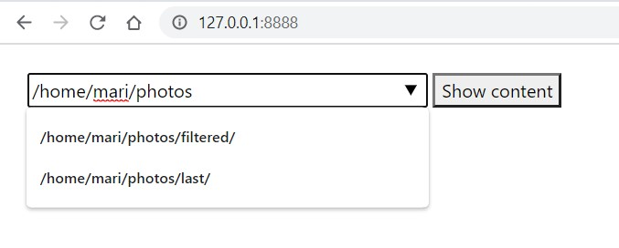
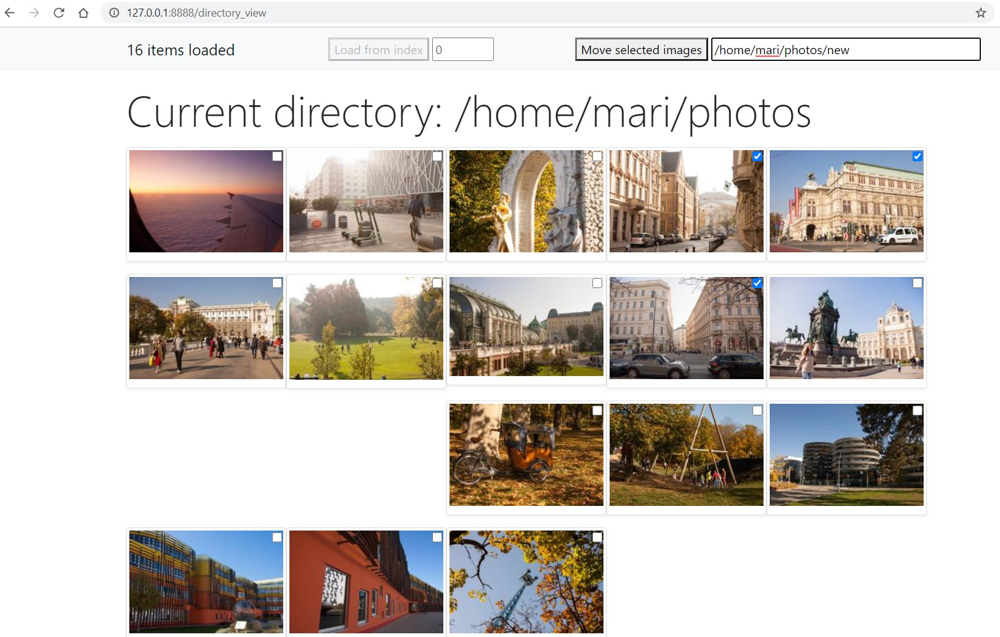

## Image directory viewer for remote headless machines. 

Whenever you need to look through huge pile of images and cannot use force and speed of file explorer, or you just work on a remote headless machine, you can use this tool.  
It also allows to move files from one folder to another, creating destination if it does not exist. There are more features, and some more is going to be added.  
Work is in progress. Stay tuned!

## Usage:
- python 3.x must be available
- (optional) create a virtual environment 
- install requirements using `pip install -r requirements.txt`
- just run `python app.py`
- if you are on headless machine, use its ip address to connect, otherwise - use localhost
- enter session code from console to form input and you are all ready

## Features
- lazy loading
- path autocomplete
- text inputs submit on Enter
- loading images starting from provided index
- possible to move any number of images from current folder to any other, creating one on its way if needed
